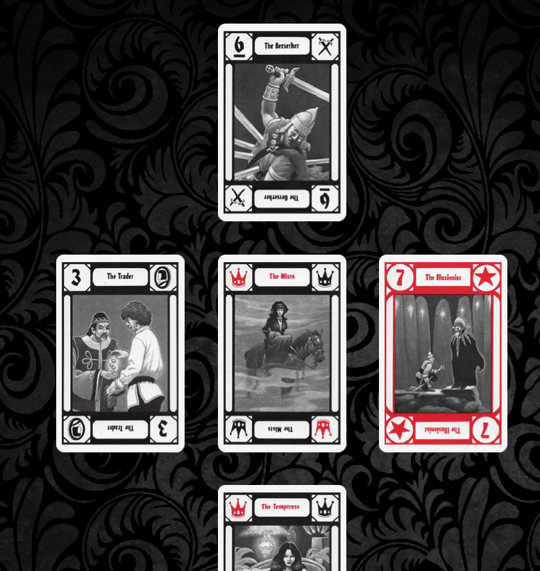

- Começamos com a viagem de [[Rosewind]] para [[Luwnen]], que dura uns dois dias e meio
	- A viagem transcorre sem intercorrências
	- Vimos movimentação normal de mercantes e da [[Brigada de Anahita]]
	- Dias de sol, final de primavera
	- Conversamos sobre o ocorrido
		- [[Dare]] diz que não sabe exatamente como canalizou o poder do amuleto
		- [[Lucky]] e [[Dare]] me perguntam sobre eu ter sido poupada e ter falado a língua do
		- Eu conecto o cântico de "fora do ciclo" com a [[leitura de Tarokka]] ((63f7a123-3558-45c2-98fd-b2e26bb7b2f8))
		- [[Cipri]] lê Tarokka pra mim também
			- Meu desafio é oculto de uma maneira mais pesada do que o normal
			- 
	- [[Dare]] levanta uma discussão sobre nossas táticas de batalha, em particular quando um de nós estiver envolvido em remendar feridas planares
		- Decidimos que vamos compartilhar as informações que temos sobre isso
	- [[Lucky]] traz a ideia de tentarmos contatar gente de [[turmion]] quando estivermos em [[Luwnen]]
	- Discussões sobre as perspectivas
		- [[Dare]] e [[Lucky]] discordam comigo que falar abertamente com [[Ida Baruara]] seja uma boa ideia
		- [[Cipri]] defende que a gente  "pegue emprestado" as [[jóias da criação]], eu sou contra fazermos isso com [[niridia]] antes de [[khreven]] e [[idrarus]]
	- [[Lucky]] dá o [[baralho de ilusões]] para [[Cipri]]
	- Eu levanto a ideia de fazermos uma caixa comum d[[A Liga]]
		- [[Lucky]] não gosta da ideia, [[Dare]] acha okay, os demais são neutros
		- [[Lucky]] sugere usar o nome [[Fundo de Ariadne]] para isso, como maneira de honrá-la
		- Consigo convencer a guardar 1/6 do que a gente ganhar
	- Falamos um pouco sobre a [[Coruja dos Novos Ares]], me dá vontade de escrever uma música sobre
- Terminamos a sessão logo chegando em [[Luwnen]]